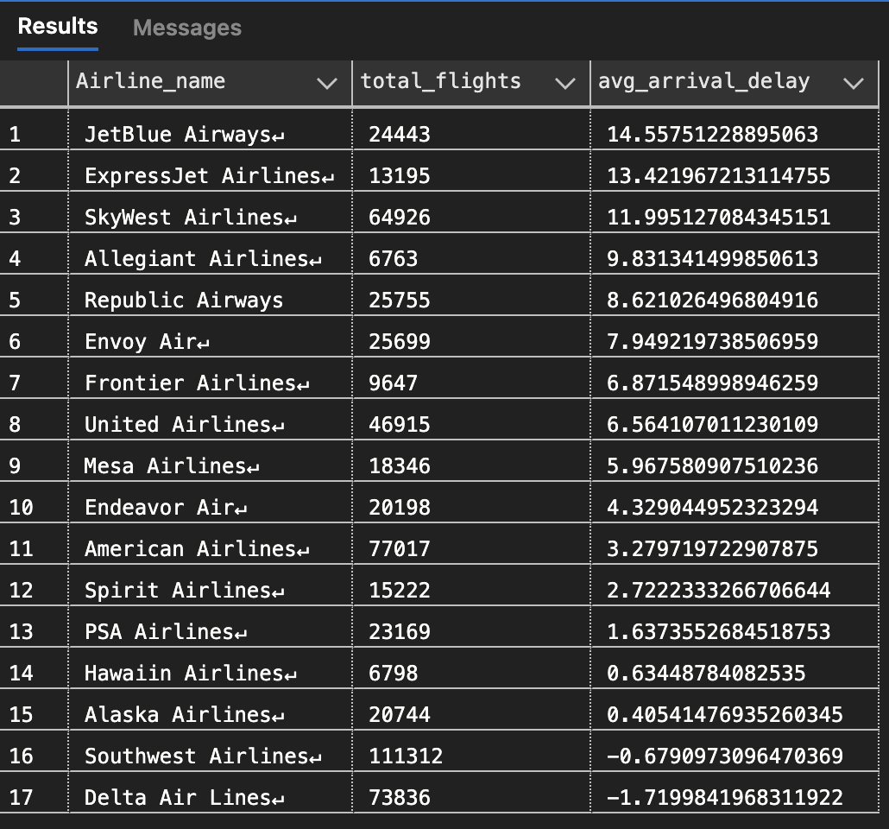
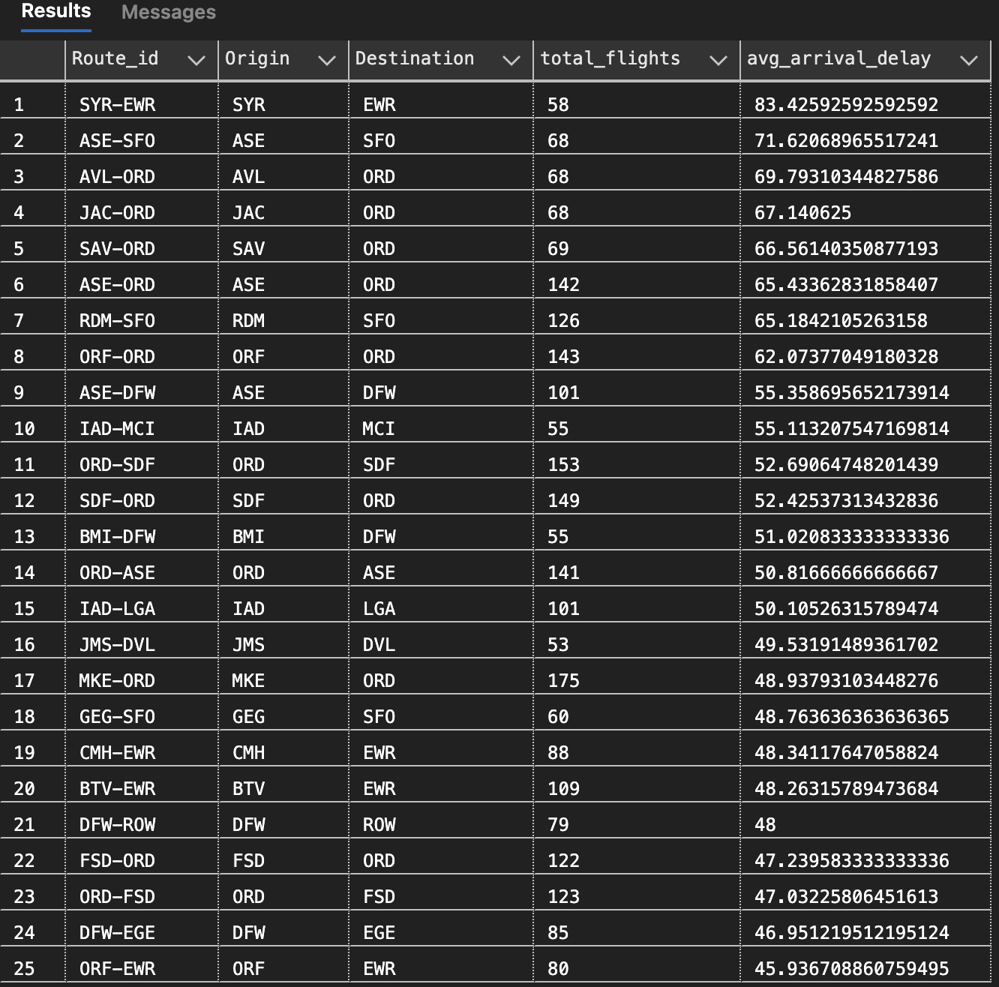
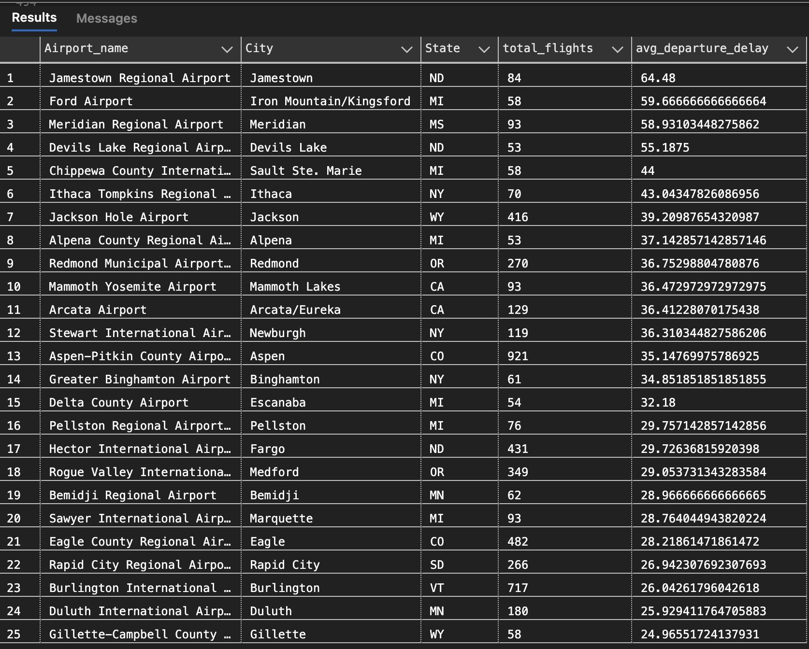
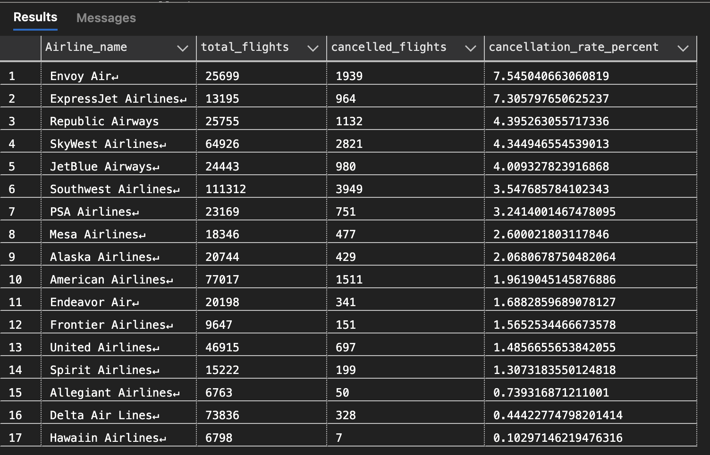

# ✈️ Flight Delay Analysis – Business Insights

## 📊 Overview

This analysis explores airline performance, route efficiency, airport operations, and external factors such as weather and scheduling.
All queries were executed against the **Gold layer** of a custom-built data warehouse using a medallion architecture (Bronze → Silver → Gold).

The objective is to identify meaningful patterns in delays and cancellations using SQL-driven analysis.

---

## 🧠 Key Business Questions

1. Which airlines have the highest average arrival delay?
2. Which routes experience the highest average arrival delays?
3. Which airports have the highest average departure delays?
4. Which airlines have the highest cancellation rates?
5. How do weather conditions impact arrival delays?
6. Are weekend flights more prone to delays than weekday flights?

---

## 🔍 Analysis & Insights

### 1. Which airlines have the highest average arrival delay?



**Insight:**
JetBlue Airways and ExpressJet Airlines exhibit the highest average arrival delays, with delays exceeding 13 minutes on average. In contrast, Delta Air Lines and Southwest Airlines show negative or near-zero delays, indicating stronger on-time performance and operational efficiency.

---

### 2. Which routes experience the highest average arrival delays?



**Insight:**
The most delayed routes are concentrated among lower-frequency regional routes (e.g., SYR → EWR, ASE → SFO), with average delays exceeding 60 minutes. This suggests that smaller or less frequent routes may be more vulnerable to disruptions and scheduling inefficiencies.

---

### 3. Which airports have the highest average departure delays?



**Insight:**
Regional airports such as Jamestown Regional Airport and Ford Airport show the highest average departure delays, often exceeding 50 minutes. This indicates that smaller airports may face operational constraints such as limited staffing, weather sensitivity, or infrastructure limitations.

---

### 4. Which airlines have the highest cancellation rates?



**Insight:**
Envoy Air and ExpressJet Airlines have the highest cancellation rates, exceeding 7%, significantly higher than major carriers like Delta and Hawaiian Airlines. This highlights potential reliability differences between regional and major carriers.

---

### 5. How do weather conditions impact arrival delays?


**Insight:**
Surprisingly, flights with no precipitation show slightly higher average delays compared to those with precipitation. This suggests that factors beyond weather—such as traffic volume or operational constraints—may have a stronger influence on delays in this dataset.

---

### 6. Are weekend flights more prone to delays than weekday flights?


**Insight:**
Weekday flights exhibit higher average arrival delays compared to weekend flights, indicating that increased traffic volume and operational demand during weekdays may contribute more significantly to delays than weekend travel patterns.

---

## ⚙️ Technical Notes

* Data processed using a **medallion architecture**:

  * Bronze: Raw ingestion
  * Silver: Data cleaning and transformation
  * Gold: Business-ready analytical views
* SQL used for all transformations and analysis
* Natural keys were retained for clarity and simplicity in joins
* Data types standardized in Silver layer to support aggregation and analysis

---

## 📁 Project Structure

```text
Analysis/
│
├── business_insights/
│   └── flight_delay_analysis.sql
│
├── analysis_results/
│   ├── airline_delay.png
│   ├── route_delay.png
│   ├── airport_delay.png
│   ├── highest_cancellation_per_airport.png
│   ├── weather_impact_delay.png
│   ├── weekend_arrival_impact.png
│
└── README.md
```

---

## 🚀 Summary

This analysis demonstrates the ability to:

* Design and implement a full data warehouse using SQL
* Transform raw data into structured, analysis-ready datasets
* Perform meaningful business analysis using SQL queries
* Communicate insights clearly and effectively for decision-making

---

